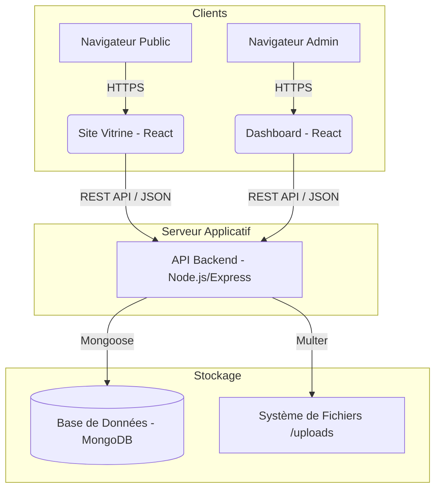
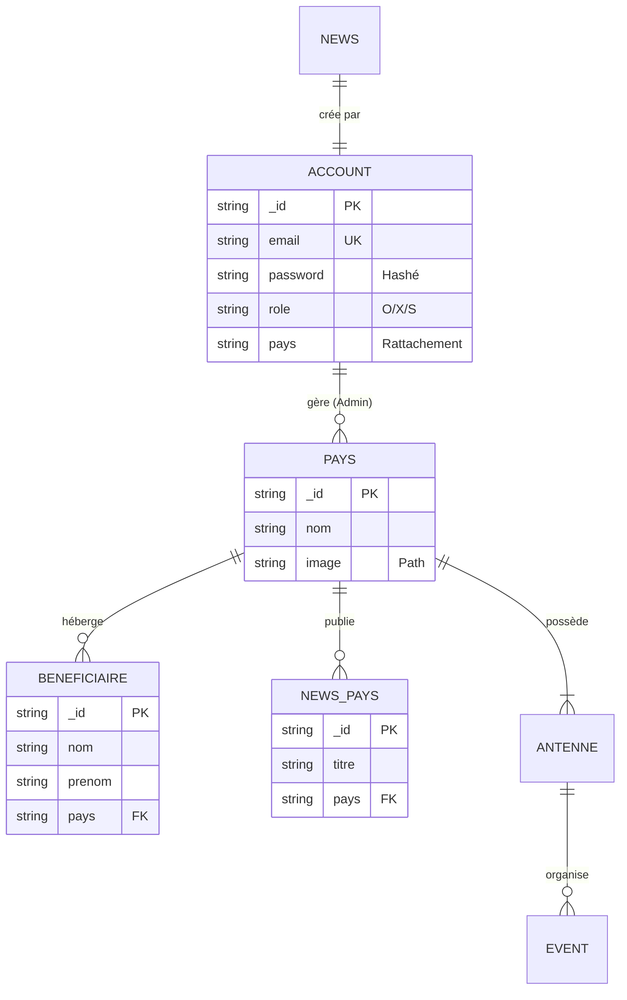

# Documentation Technique - Projet Dreams

**Version:** 1.3.0

**Date:** 10 Décembre 2025

---

## Sommaire
1.  [Introduction](#1-introduction)
2.  [Architecture du Système](#2-architecture-du-système)
3.  [Modélisation des Données](#3-modélisation-des-données)
4.  [Spécifications Techniques](#4-spécifications-techniques)
5.  [Sécurité](#5-sécurité)
6.  [Guide d'Installation](#6-guide-dinstallation)


---

## 1. Introduction

### 1.1 Contexte
Le projet **Dreams** est une plateforme web intégrée destinée à la gestion opérationnelle et à la promotion de l'association Dreams. Elle centralise les processus administratifs via un tableau de bord et assure la visibilité publique via un site vitrine.

### 1.2 Périmètre
Le système couvre les domaines fonctionnels suivants :
-   **Gestion des Adhérents** : Création, suivi, et administration des membres (Admins, Super-Admins).
-   **Gestion des Pays** : Administration des antennes locales, informations pratiques et actualités liées.
-   **Gestion des Bénéficiaires** : Suivi des personnes aidées par l'association.
-   **Gestion Événementielle** : Planification et affichage des événements.
-   **Communication** : Diffusion d'actualités globales et locales.

---

## 2. Architecture du Système

### 2.1 Vue d'ensemble
Le projet repose sur une architecture **MCV**, séparant strictement la logique métier (Backend) des interfaces utilisateurs (Frontends).



### 2.2 Composants
*   **Backend (API Server)** : Node.js avec Express. Il expose une API RESTful sécurisée.
*   **Dashboard** : Single Page Application (SPA) React pour l'administration.
*   **Site Vitrine** : SPA React pour le grand public.
*   **Base de Données** : MongoDB, choisie pour sa flexibilité de schéma (NoSQL).

---

## 3. Modélisation des Données

Le schéma de données est géré via l'ODM Mongoose. Voici le diagramme Entité-Association simplifié :



---

## 4. Spécifications Techniques

| Composant | Technologie | Version | Rôle |
| :--- | :--- | :--- | :--- |
| **Backend** | Node.js | 16+ | Runtime JS |
| | Express | 5.x | Framework Web |
| | Mongoose | 8.x | ODM MongoDB |
| **Database** | MongoDB | 5.0+ | Persistance des données |
| **Frontend** | React | 19 | Bibliothèque UI |
| | Vite | 7.x | Bundler & Dev Server |
| | TailwindCSS | 4.x | Framework CSS |
| | TypeScript | 5.x | Typage statique |

---

## 5. Sécurité

### 5.1 Authentification
L'authentification repose sur le standard **JWT (JSON Web Token)**.
1.  L'utilisateur s'identifie via `/api/auth/login`.
2.  Le serveur valide les identifiants hashés (`bcrypt`).
3.  Un token JWT signé est renvoyé.
4.  Ce token doit être inclus dans le header `Authorization: Bearer <token>` de chaque requête protégée.

### 5.2 Contrôle d'Accès
Trois niveaux de privilèges sont définis :
*   **"S" (Super Admin)** : Accès total système, création de pays, gestion des admins.
*   **"X" (Admin Pays)** : Gestion limitée à son pays de rattachement (utilisateurs, actus locales).
*   **"O" (Bénévoles)** : Accès limité à l'administration des bénéficiaires.

### 5.3 Protection CSRF
Nous avons implémenté le pattern **Double-Submit Cookie** pour protéger le point critique de rafraîchissement des tokens (`/refresh`).
-   Un cookie non-HttpOnly `XSRF-TOKEN` est généré aléatoirement lors du login.
-   Pour chaque requête de refresh, le client doit lire ce cookie et l'envoyer dans le header `X-XSRF-TOKEN`.
-   Le serveur vérifie la correspondance entre le cookie et le header, bloquant ainsi les attaques CSRF cross-origin.


---

## 6. Guide d'Installation

### 6.1 Prérequis
Assurez-vous que votre environnement dispose de :
*   Node.js (v16 ou supérieur)
*   npm (v8 ou supérieur)
*   Git
*   Une instance MongoDB active (locale ou Atlas)

### 6.2 Déploiement Local
1.  **Clonage du dépôt**
    ```bash
    git clone https://github.com/34lks66/IUT-Blagnac-sae-5-01-devapp-dreams-2025-2g1a.git
    cd dev
    ```

2.  **Installation des dépendances**
    Nous utilisons un script script unifié pour installer les dépendances du monorepo :
    ```bash
    npm run install-all
    ```

3.  **Configuration Environnement**
    Créez un fichier `.env` dans `dev/backend` :
    ```env
    PORT=5000
    MONGO_URI=mongodb://localhost:27017/dreams
    JWT_SECRET=votre_cle_secrete_complexe
    ```

4.  **Démarrage**
    Lancez l'écosystème complet en mode développement :
    ```bash
    npm start
    ```
    *   API : `http://localhost:5000`
    *   Dashboard : `http://localhost:5173`
    *   Site : `http://localhost:5174`

---
